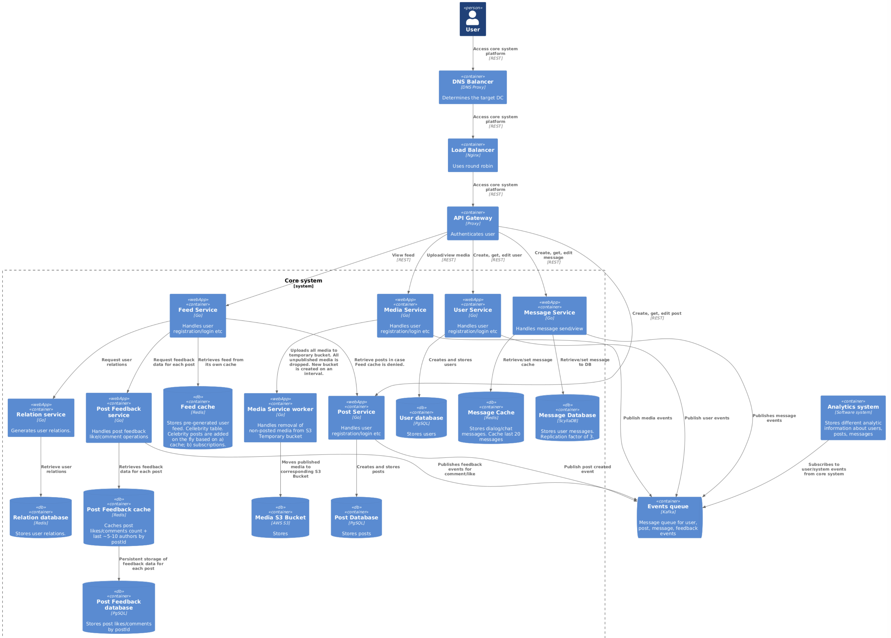
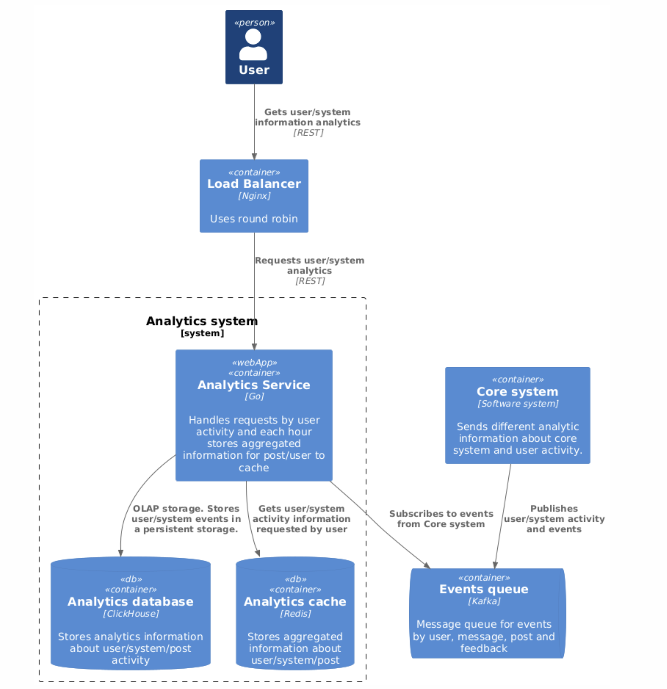

# Social network ( Facebook ) - System Design

Facebook is a social network platform which allows users to create online profiles, connect with friends, create posts, send messages, view post feed, leave comments and likes

### Functional requirements:

- add/delete/view friends and their profiles
- view home/user feed
- create/edit/delete posts
- send messages in groups/channels or in private
- posts and messages can contain media
- create/edit/view user profiles

### Non-functional requirements:

- DAU 70,000,000
- Availability 99.95%
- Avg. post size 4000 bytes
- Max. post size 10000 bytes
- Avg. post read / day 20
- Avg. post write / day 5
- Avg. profile view / day 10
- Response time send 1 s
- Response time read 5 s
- Post storage age Infinity
- Max group members count 1000
- Max channel subscribers 100,000
- No region preference
- No seasonality

## Design overview

For system design I have  used [C4 model](https://c4model.com/). The C4 model was created as a way 
to help software development teams describe and communicate software 
architecture, both during up-front design sessions and when retrospectively 
documenting an existing codebase. It's a way to create maps of your code, 
at various levels of detail, in the same way you would use something like 
Google Maps to zoom in and out of an area you are interested in.

     <b>Level 1.</b> System context diagram  

  

     <b>Level 2.</b> Core system container diagram  

 

  

     <b>Level 2.</b> Analytics system container diagram  

 

  

## Basic calculations

###### DAU = 70,000,000

RPS (view post):

   Each user reads 10 posts per day
   RPS = 70,000,000 * 10 / 86400 ~= 8000

RPS (write post):

    Each user writes 2 posts per day
    RPS = 70,000,000 * 2 / 86400 ~= 1600

RPS (read message):

    Each user reads 80 messages per day
    RPS = 70,000,000 * 80 / 86400 ~= 64,000

RPS (send message):

    Each user sends 20 messages per day
    RPS = 70,000,000 * 20 / 86400 ~= 16,000

Total Bandwidth:

    Total RPS = (8000 + 1600 + 16000 + 64000) = 89,600
    Data per second = 89,600 * 4kb = 358,400 kb/s = 350 mb
    Data per day = 350 mb/s * 86400 = 30.2 TB
    Data per year = 30.2 TB * 365 = 11 PB

Required memory:

    Replication factor of 3
    Service operation time = 5 years
    Write RPS = 1600 + 16000 = 17600
    Data per second = 17600 * 4 = 70mb
    Data per day = 70 * 86400 = 6 TB
    Data per year = 6 * 365 = 2.2 PB
    With replication (3x) = 6.6 PB
    With backups (+15%) = 7.6 PB
    For 5 years: 38 * 5 = 38 PB