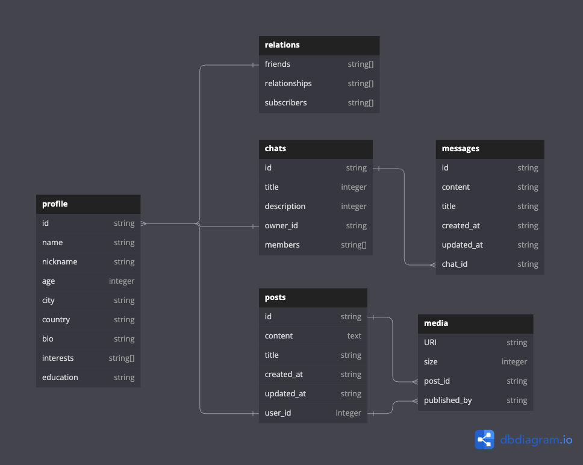

Design a database(s) for a social network:

User profiles: name, description, photo, city, interests.
Posts: description, media, hashtags, likes, views, comments.
Private messages and chats: text only and message read status.
Relationships: friends, followers, romantic relationships.
Media: photos, audio, videos.

[DB Diagram Link](https://dbdiagram.io/d/social_network-6793a340263d6cf9a0f9c1fc)

